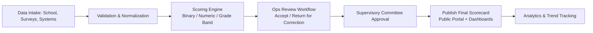
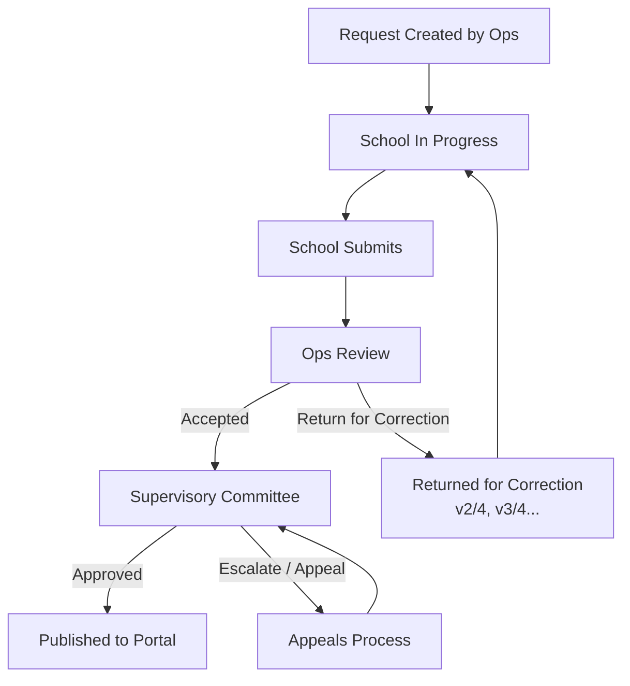

# Madares Score System – Complete Technical Design Blueprint

**Saudi Ministry of Education – Private Education Agency**  
**System Architecture & UX Strategy**  
**Date:** October 27, 2025

---

## 0. High-Level Responsibilities

This blueprint defines the complete system architecture, workflows, data structures, scoring logic, and UI surfaces for the **Madares Score System**, which evaluates private schools across three domains:

1. **Compliance** (binary: Compliant / Not Compliant, confirmed by Ministry Reviewers)
2. **Institutional Excellence** (numeric 0–100% + Grade band A+–F, formula-based)
3. **Beneficiary Satisfaction** (numeric 0–100% + Grade band A+–F, survey/sentiment-based)

### Intended Audiences

- **Product Leadership**: Policy + governance clarity
- **Engineering Teams**: Data contracts, flows, permissions
- **Prototype Teams**: React/Tailwind UI-only click-through demo

### Core Constraints

- **Compliance**: Binary, manually verified by Ops
- **Institutional Excellence & Beneficiary Satisfaction**: Calculated, not free-typed by schools
- **School Admin**: Cannot directly edit numeric indicator results
- **System Features**: SLA timers, locking rules (no duplicate active requests), version tracking (1/4 → 2/4), "Return for Correction" loops

---

## 1. System Architecture

### Architecture Layers

| Layer | Description / Responsibilities |
|-------|-------------------------------|
| **Data Intake Layer** | Collects self-assessment fields, supporting evidence uploads, survey/sentiment data, and select operational metrics. Sources: school-entered fields, satisfaction surveys, licensing/compliance systems, Noor student/teacher counts, etc. |
| **Processing & Scoring Engine** | Applies indicator formulas, weighting, normalization rules, and aggregates per-domain and total score. For Compliance: binary. For Excellence & Satisfaction: numeric + grade band. Locks calculated values so they cannot be edited by School Admin or Ops. |
| **Workflow Engine** | Orchestrates status transitions and versioning: Request Created → In Progress → Submitted → Under Review → Returned for Correction (v2/4, v3/4...) → Approved → Published. Enforces that each school may only have ONE active evaluation request at a time. Tracks SLA per stage. |
| **Notification & SLA Service** | Sends reminders before deadlines, escalates SLA breaches to supervisors, and raises "red flag" states (e.g. repeated violations, expired licenses). |
| **Dashboards & Analytics Layer** | Multi-role dashboards (Ops, School Admin, Committee, Appeals, National). Each has tailored filters, KPIs, and actions. |
| **Public Transparency Portal** | Approved, published scorecards searchable by parents (school name, city, gender model, stage). Shows Compliance (pass/fail) and grade bands for Excellence/Satisfaction. |

### System Flow Diagram



---

## 2. Evaluation Request Lifecycle

### 2.1 Step-by-Step Narrative

1. **Request Creation**
   - Ops (Ministry Reviewers) create an Evaluation Request in bulk using filters (Region, City, School Level, etc.)
   - Every filter includes an "All" option for bulk selection
   - System creates one active request per selected school
   - **Hard Rule**: A school cannot receive another active request until the current one is closed

2. **School Receives Request**
   - School Admin sees "Current Evaluation" with:
     - Status
     - Deadline
     - Request version (e.g., 1/4)
     - Completion %
     - List of Pending Items

3. **School Fills Data**
   - **Compliance Section**: Editable fields + upload supporting evidence inline at question level
   - **Excellence + Satisfaction Sections**: Read-only calculated indicators with dummy values (for prototype)

4. **Ops Review**
   - Ops Reviewers review each domain:
     - **CANNOT** edit values or scores
     - **CAN** mark each question "Accepted" or "Return for Correction"
     - **CAN** attach comments and save draft

5. **Correction Loop**
   - If corrections are requested:
     - System increments request version (2/4, 3/4, etc.)
     - School sees all correction notes clearly in Pending Items
     - School resubmits corrections
   - Loop repeats until Ops accepts

6. **Committee Approval**
   - After Ops finalizes, request goes to Supervisory Committee
   - Committee can:
     - Approve
     - Escalate
     - Trigger Appeals if challenged

7. **Publication**
   - Once approved, Scorecard is published to Public Portal
   - Historical data retained for trend analysis

### 2.2 Workflow Diagram



### 2.3 SLA Checkpoints

| Checkpoint | Description |
|------------|-------------|
| **School Submission Deadline** | Time allocated for school to complete initial submission |
| **Ops Review SLA** | Maximum time for Ops to complete review after school submission |
| **Correction Turnaround SLA** | Time allocated for school to address returned corrections |
| **Committee Decision SLA** | Maximum time for Committee to approve/escalate after Ops approval |
| **Appeals SLA** | Maximum time to resolve appeals if triggered |

---

## 3. Personas (Condensed Table)

| Persona | Role | Goals | Pain Points | Typical Actions |
|---------|------|-------|-------------|-----------------|
| **Ahmad (School Admin)** | School Administrator managing evaluation | Complete evaluation on time, understand what's missing, address corrections quickly | Unclear requirements, tight deadlines, confusion about correction requests | Monitors completion %, checks Pending Items, uploads evidence, responds to corrections, communicates via School Notes |
| **Sara (Compliance Officer / Ops)** | Ministry Reviewer evaluating school compliance | Review submissions efficiently, ensure evidence quality, maintain SLA compliance, track throughput | High volume of requests, inconsistent evidence quality, schools missing deadlines | Filters schools by region/level, reviews evidence, marks Accepted/Return for Correction, adds comments, tracks SLA |
| **Dr. Lina (Supervisory Committee / Policy Director)** | Policy Director overseeing scoring model | Ensure scoring model aligns with evolving MoE policy, adjust weights based on strategic priorities | Need to balance multiple policy objectives, difficulty predicting impact of weight changes | Adjusts domain and indicator weights, proposes new indicators, creates custom domains, approves policy changes |
| **Omar (Appeals Officer)** | Officer handling school appeals | Resolve appeals fairly and quickly, maintain defensible audit trail | Limited context on historical decisions, pressure to resolve quickly while ensuring fairness | Reviews evidence trail, examines Ops and Committee comments, tracks appeal SLA, makes recommendations |

---

## 4. User Stories with Acceptance Criteria

### 4.1 School Admin – Current Evaluation View

**User Story:**
> "As a School Admin, I want to see my Evaluation Request status, required items, deadline, completion %, and requested corrections in one place so I can resolve everything before the deadline."

**Acceptance Criteria:**

- **Given** a School Admin logs into the system  
  **When** they navigate to "Current Evaluation"  
  **Then** they see:
  
  - **Request Overview** displaying:
    - Version (1/4, 2/4, etc.)
    - Status (In Progress, Submitted, Returned for Correction, etc.)
    - Deadline with countdown timer
    - Completion percentage
  
  - **Pending Items Section** showing:
    - Missing data fields (red indicators)
    - Missing documents (document icons)
    - Returned-for-correction notes from Ops with clear context
  
  - **Domain Sections** with:
    - **Compliance**: Editable fields + inline evidence upload widgets
    - **Institutional Excellence**: Read-only calculated values (dummy data in prototype)
    - **Beneficiary Satisfaction**: Read-only calculated values (dummy data in prototype)
  
  - **Navigation Controls**:
    - "Previous" / "Next" buttons always visible at bottom
    - Buttons maintain state across sections
  
  - **Read-Only Score Column**:
    - Indicators Score column is read-only and cannot be edited
    - Clearly labeled as "Calculated by System"

### 4.2 Compliance Reviewer / Ops (Sara)

**User Story:**
> "As a Compliance Reviewer, I want to filter schools and open their evaluation requests so I can review evidence, mark items Accepted or Return for Correction, track versions, and stay within SLA."

**Acceptance Criteria:**

- **Given** Ops is on the Evaluation Requests dashboard  
  **When** they use the filter panel  
  **Then**:
  
  - Filter options include: Region, City, School Level, Gender Model, Status
  - Each filter includes "All" option
  - Filters can be combined (multi-select)
  - Results update in real-time
  
- **Given** filtered results are displayed  
  **When** Ops views the Evaluation Requests table  
  **Then** they see:
  
  | Column | Description |
  |--------|-------------|
  | Request ID | Unique identifier (clickable) |
  | School Name | Official school name |
  | Region/City/Level | School metadata |
  | Status | Current state + correction cycle count (e.g., "Returned for Correction (2/4)") |
  | Deadline/SLA | Time remaining with color coding (green/yellow/red) |
  | Actions | Dropdown menu with "Open Review" |
  
- **Given** Ops clicks Request ID or "Open Review"  
  **When** Current Evaluation (Ops view) loads  
  **Then**:
  
  - System blocks duplicate active requests for the same school
  - Reviewer sees all submitted answers and uploaded evidence
  - For each question, Reviewer can:
    - Mark "Accepted" or "Return for Correction"
    - Add comments (required for corrections)
    - View evidence inline
  - Reviewer can:
    - Save Draft without finalizing (preserves all selections and comments)
    - Approve entire request (advances to Committee)
    - Return for Correction (increments version, notifies school)
  - **Critical Constraint**: Reviewer cannot:
    - Edit calculated scores
    - Modify school-entered field values
    - Override indicator results

### 4.3 Supervisory Committee (Dr. Lina)

**User Story:**
> "As a Supervisory Committee Member, I want to adjust domain and indicator weights and introduce new indicators/domains so the model stays aligned with evolving MoE policy."

**Acceptance Criteria:**

- **Given** Dr. Lina accesses the Committee Dashboard  
  **When** she navigates to "Weights & Indicators Management"  
  **Then**:
  
  - Editable weight matrix displayed showing:
    - Domain-level weights (percentage totaling 100%)
    - Indicator-level weights within each domain (scale 1–5)
  
  - For each indicator, she can:
    - Adjust weight (1–5 slider)
    - View current formula and data sources
    - Enable/Disable indicator
    - Propose changes with justification notes
  
  - **New Indicator Creation**:
    - Form to define: Code, Name (AR/EN), Formula, Weight, Data Source
    - Ability to assign to existing domain or create new custom domain
  
  - **Custom Domain Creation**:
    - Define domain name (AR/EN)
    - Assign initial weight
    - Add indicators to domain
  
  - **Approval Workflow**:
    - All changes go to "Pending Approval" state
    - Requires second Committee member approval
    - Changes do not affect live scoring until approved
    - Historical weight versions maintained with timestamps

---

## 5. Domain Model & Indicator Structure

### 5.1 Domain Weights Table

| Domain | Weight | Focus Areas | Scoring Style |
|--------|--------|-------------|---------------|
| **Compliance** | 50% | Policies, safety, finance, academic standards | Binary: "Compliant / Not Compliant." Confirmed by Ops. No numeric grades here. |
| **Institutional Excellence** | 30% | Teaching quality, professional development, infrastructure, outcomes | Numeric (0–100%) + Grade Band (A+–F). Calculated from formulas, ratios, completion rates, resolution times. |
| **Beneficiary Satisfaction** | 20% | Parent, student, teacher sentiment | Numeric (0–100%) + Grade Band (A+–F). Derived from surveys, incident rates, safety/engagement indexes. |

**Note:** Weights are policy-adjustable by Supervisory Committee with approval workflow.

### 5.2 Indicator Schema

| Field | Description | Example |
|-------|-------------|---------|
| **indicator_code** | Unique identifier | `"C102"`, `"E205"`, `"S301"` |
| **domain** | Parent domain | `"Compliance"`, `"Institutional Excellence"`, `"Beneficiary Satisfaction"` |
| **sub_category** | Logical grouping | `"Health & Safety"`, `"Teaching Quality"`, `"Parent Engagement"` |
| **formula** | Human-readable calculation | `"% of resolved violations ≤10 days"` |
| **weight** | Importance factor within domain | `1` (low) to `5` (critical) |
| **type** | Data entry method | `"M"` (Manual entry), `"A"` (Automatic from systems) |
| **score_type** | Output format | `"B"` (Binary), `"N"` (Numeric %), `"G"` (Grade Band) |
| **data_source** | Origin of raw data | `"MoE CMS"`, `"Survey API"`, `"School self-report"`, `"Noor"` |
| **calculation_inputs** | Required raw fields | Array of field names: `["violations_resolved_under_10_days", "total_violations"]` |

### 5.3 Example Indicator Definitions (JSON)

```json
{
  "indicators": [
    {
      "indicator_code": "C102",
      "domain": "Compliance",
      "sub_category": "Health & Safety",
      "name_ar": "شهادة السلامة من الحريق سارية المفعول",
      "name_en": "Valid Fire Safety Certificate",
      "formula": "Document uploaded and verified by Ops",
      "weight": 5,
      "type": "M",
      "score_type": "B",
      "data_source": "School self-report + Ops verification",
      "calculation_inputs": ["fire_safety_cert_upload", "fire_safety_cert_expiry"],
      "required": true
    },
    {
      "indicator_code": "E205",
      "domain": "Institutional Excellence",
      "sub_category": "Teaching Quality",
      "name_ar": "نسبة المعلمين المدربين",
      "name_en": "Teacher Training Completion Rate",
      "formula": "(teachers_completed_pd / total_teachers) * 100",
      "weight": 4,
      "type": "A",
      "score_type": "N",
      "data_source": "Noor + MoE PD System",
      "calculation_inputs": ["teachers_completed_pd", "total_teachers"],
      "required": false,
      "target_threshold": 80
    },
    {
      "indicator_code": "S301",
      "domain": "Beneficiary Satisfaction",
      "sub_category": "Safety & Engagement",
      "name_ar": "مؤشر السلامة (معدل حوادث التنمر)",
      "name_en": "Safety Index (Bullying Incident Rate)",
      "formula": "100 - ((bullying_incidents / total_students) * 1000)",
      "weight": 5,
      "type": "A",
      "score_type": "N",
      "data_source": "School incident reports + Survey API",
      "calculation_inputs": ["bullying_incidents", "total_students"],
      "required": true,
      "invert_score": true
    }
  ]
}
```

---

## 6. Scoring Engine Rules

### 6.1 Grade Band Mapping

| Numeric Score | Grade Band | Color Code | Description |
|---------------|------------|------------|-------------|
| 95–100% | A+ | Dark Green | Exceptional |
| 90–94% | A | Green | Excellent |
| 85–89% | B+ | Light Green | Very Good |
| 80–84% | B | Yellow-Green | Good |
| 75–79% | C+ | Yellow | Satisfactory |
| 70–74% | C | Light Yellow | Acceptable |
| 65–69% | D+ | Orange | Needs Improvement |
| 60–64% | D | Light Orange | Below Standard |
| 50–59% | E | Red-Orange | Poor |
| 0–49% | F | Red | Failing |

### 6.2 Calculation Examples

#### Institutional Excellence Domain

```
Domain Score = Σ (Indicator Score × Indicator Weight) / Σ (Indicator Weight)
```

**Example:**
- E201 (Teacher Qualifications): 85% × weight 5 = 425
- E202 (PD Completion): 78% × weight 4 = 312
- E203 (Student-Teacher Ratio): 92% × weight 3 = 276
- E204 (Infrastructure Quality): 88% × weight 4 = 352
- E205 (Avg Resolution Time): 75% × weight 3 = 225

**Calculation:**
```
Excellence Score = (425 + 312 + 276 + 352 + 225) / (5 + 4 + 3 + 4 + 3)
                 = 1590 / 19
                 = 83.68%
                 → Grade Band: B
```

#### Beneficiary Satisfaction Domain

Uses same weighted average approach but incorporates:
- Survey sentiment scores (parent/student/teacher)
- Incident rates (normalized and inverted)
- Engagement metrics (participation rates)

### 6.3 Sample School Score Output (JSON)

```json
{
  "school_id": "SCH-2025-1234",
  "evaluation_request_id": "REQ-2025-5678",
  "evaluation_date": "2025-10-15",
  "version": "1/4",
  "status": "Published",
  "domains": {
    "compliance": {
      "weight": 0.50,
      "result": "Compliant",
      "score_display": "Pass",
      "indicators": [
        {
          "code": "C101",
          "name_en": "Valid Operating License",
          "result": "Compliant",
          "evidence": ["license_2025.pdf"],
          "verified_by": "sara.reviewer@moe.sa",
          "verified_date": "2025-10-12"
        },
        {
          "code": "C102",
          "name_en": "Valid Fire Safety Certificate",
          "result": "Compliant",
          "evidence": ["fire_cert_2025.pdf"],
          "verified_by": "sara.reviewer@moe.sa",
          "verified_date": "2025-10-12"
        }
      ]
    },
    "institutional_excellence": {
      "weight": 0.30,
      "score": 83.68,
      "grade_band": "B",
      "color": "yellow-green",
      "indicators": [
        {
          "code": "E201",
          "name_en": "Teacher Qualifications",
          "score": 85.0,
          "weight": 5,
          "data_source": "Noor",
          "calculation": {
            "qualified_teachers": 34,
            "total_teachers": 40,
            "formula": "(34/40) * 100"
          }
        },
        {
          "code": "E205",
          "name_en": "Teacher Training Completion",
          "score": 78.0,
          "weight": 4,
          "data_source": "MoE PD System",
          "calculation": {
            "teachers_completed_pd": 31,
            "total_teachers": 40,
            "formula": "(31/40) * 100"
          }
        }
      ]
    },
    "beneficiary_satisfaction": {
      "weight": 0.20,
      "score": 89.5,
      "grade_band": "B+",
      "color": "light-green",
      "indicators": [
        {
          "code": "S301",
          "name_en": "Safety Index",
          "score": 94.5,
          "weight": 5,
          "data_source": "School incident reports",
          "calculation": {
            "bullying_incidents": 2,
            "total_students": 450,
            "formula": "100 - ((2/450) * 1000)"
          }
        },
        {
          "code": "S302",
          "name_en": "Parent Satisfaction Survey",
          "score": 87.3,
          "weight": 4,
          "data_source": "Survey API",
          "calculation": {
            "survey_responses": 320,
            "avg_satisfaction": 4.36,
            "formula": "(4.36/5) * 100"
          }
        }
      ]
    }
  },
  "overall_score": {
    "weighted_average": 84.2,
    "grade_band": "B",
    "calculation": "(0.5 * 100) + (0.3 * 83.68) + (0.2 * 89.5)",
    "display_note": "Compliance shown as Pass/Fail; grade only for Excellence and Satisfaction"
  }
}
```

---

## 7. Dashboard & UI Components

### 7.1 Evaluation Requests Table (Ops View)

**Purpose:** Central hub for Ops to manage all evaluation requests across schools.

**Features:**

- **Filter Panel** (top of page):
  - Region (dropdown with "All")
  - City (dropdown with "All")
  - School Level (Primary, Intermediate, Secondary, All)
  - Gender Model (Boys, Girls, Co-ed, All)
  - Status (In Progress, Submitted, Under Review, Returned for Correction, etc.)
  - Clear Filters button

- **Table Columns:**

| Column | Display | Sortable | Notes |
|--------|---------|----------|-------|
| Request ID | `REQ-2025-1234` (link) | Yes | Clicking opens Current Evaluation |
| School Name | Official name | Yes | |
| Region | e.g., Riyadh | Yes | |
| City | e.g., Riyadh City | Yes | |
| Level | Primary/Intermediate/Secondary | Yes | |
| Status | Current state + cycle count | Yes | e.g., "Returned for Correction (2/4)" |
| Deadline/SLA | Days remaining, color-coded | Yes | Green >7 days, Yellow 3-7, Red <3 |
| Actions | Dropdown menu | No | "Open Review", "View History", "Add Note" |

- **Business Rules:**
  - System prevents creation of new request for a school if one is still active
  - Active request = any status except "Closed", "Published", "Archived"
  - Attempting to create duplicate shows error: "School already has active request REQ-2025-XXXX"

- **UI Enhancements:**
  - Pagination (50 per page)
  - Export to Excel
  - Bulk actions (for future: bulk assignment to reviewers)

### 7.2 Current Evaluation – Ops View

**Purpose:** Review submitted school data and mark items as Accepted or Return for Correction.

**Layout Structure:**

```
┌─────────────────────────────────────────────────────────────┐
│ REQUEST OVERVIEW                                             │
│ Version: 2/4  |  Status: Under Review  |  Deadline: 5 days   │
│ School: Riyadh International School  |  ID: REQ-2025-1234   │
└─────────────────────────────────────────────────────────────┘

┌─────────────────────────────────────────────────────────────┐
│ DOMAIN TABS                                                  │
│ [Compliance] [Institutional Excellence] [Beneficiary Sat.]  │
└─────────────────────────────────────────────────────────────┘

┌─────────────────────────────────────────────────────────────┐
│ SUBMITTED DATA & EVIDENCE (Read-Only)                       │
│                                                              │
│ Question: Do you have a valid fire safety certificate?      │
│ Answer: Yes                                                  │
│ Evidence: [fire_cert_2025.pdf] ← clickable to view/download │
│                                                              │
│ ┌─────────────────────────────────────────────────────┐    │
│ │ REVIEW CONTROLS (Per Question)                      │    │
│ │ ○ Accept    ○ Return for Correction                 │    │
│ │ Comment: _________________________________           │    │
│ └─────────────────────────────────────────────────────┘    │
│                                                              │
│ [Repeat for each question...]                               │
└─────────────────────────────────────────────────────────────┘

┌─────────────────────────────────────────────────────────────┐
│ INTERNAL NOTES (Ops-Only, Not Visible to School)           │
│ ┌─────────────────────────────────────────────────────┐    │
│ │ [Text area for Ops to add notes for other reviewers]│    │
│ └─────────────────────────────────────────────────────┘    │
└─────────────────────────────────────────────────────────────┘

┌─────────────────────────────────────────────────────────────┐
│ ACTIONS                                                      │
│ [Save Draft]  [Approve Request]  [Return for Correction]    │
└─────────────────────────────────────────────────────────────┘
```

**Key Features:**

- **Read-Only Submitted Data**: Ops sees exactly what school submitted
- **Per-Question Review**: Each question can be independently accepted or flagged
- **Comment Requirement**: If "Return for Correction" selected, comment is mandatory
- **Draft Save**: Preserves all selections and comments without finalizing
- **Final Actions**:
  - **Approve Request**: Advances to Supervisory Committee
  - **Return for Correction**: Increments version (2/4 → 3/4), notifies school, updates status

**Critical Constraints:**

- Ops cannot edit calculated scores
- Ops cannot override school-entered field values
- Ops cannot modify indicator results
- All Ops actions are logged with timestamp and user ID

### 7.3 Current Evaluation – School Admin View

**Purpose:** Allow School Admin to complete evaluation, upload evidence, and address corrections.

**Layout Structure:**

```
┌─────────────────────────────────────────────────────────────┐
│ REQUEST OVERVIEW                                             │
│ Version: 2/4  |  Status: In Progress  |  Deadline: 12 days  │
│ Completion: 75% ████████████░░░░                            │
└─────────────────────────────────────────────────────────────┘

┌─────────────────────────────────────────────────────────────┐
│ PENDING ITEMS (3 items require attention)                   │
│ ⚠️ Missing: Fire Safety Certificate upload                  │
│ ⚠️ Correction Requested: Operating license expired - please │
│    provide renewed license (Ops comment: "Certificate shows │
│    expiry date of June 2025, please upload current cert")   │
│ ⚠️ Missing: Teacher training completion data                │
└─────────────────────────────────────────────────────────────┘

┌─────────────────────────────────────────────────────────────┐
│ DOMAIN TABS                                                  │
│ [Compliance] [Institutional Excellence] [Beneficiary Sat.]  │
└─────────────────────────────────────────────────────────────┘

┌─────────────────────────────────────────────────────────────┐
│ COMPLIANCE SECTION (Editable)                               │
│                                                              │
│ Question: Do you have a valid fire safety certificate?      │
│ ○ Yes  ○ No  ○ N/A                                          │
│ Upload Evidence: [Choose File] [Upload]                     │
│ Uploaded: fire_cert_2025.pdf [View] [Remove]               │
│                                                              │
│ [Next Question...]                                          │
└─────────────────────────────────────────────────────────────┘

┌─────────────────────────────────────────────────────────────┐
│ INSTITUTIONAL EXCELLENCE (Read-Only Calculated)             │
│                                                              │
│ Indicator: Teacher Training Completion Rate                 │
│ Score: 78% (Calculated by System)                           │
│ Data Source: Noor + MoE PD System                           │
│ Details: 31 of 40 teachers completed PD                     │
│                                                              │
│ [Indicators are displayed but cannot be edited]             │
└─────────────────────────────────────────────────────────────┘

┌─────────────────────────────────────────────────────────────┐
│ SCHOOL NOTES (Optional - Visible to Ops)                    │
│ ┌─────────────────────────────────────────────────────┐    │
│ │ Add any notes or context for reviewers...           │    │
│ └─────────────────────────────────────────────────────┘    │
└─────────────────────────────────────────────────────────────┘

┌─────────────────────────────────────────────────────────────┐
│ NAVIGATION                                                   │
│ [Previous]  [Save Draft]  [Submit for Review]  [Next]       │
└─────────────────────────────────────────────────────────────┘
```

**Key Features:**

- **Request Overview**: Always visible at top with version, status, deadline, completion %
- **Pending Items**: Prominent alert section showing exactly what needs attention
- **Compliance Fields**: Editable with inline evidence upload at question level
- **Excellence/Satisfaction**: Read-only calculated values (clearly labeled)
- **Score Column**: Always read-only, labeled "Calculated by System"
- **Navigation**: Previous/Next buttons always visible at bottom
- **Auto-Save**: Drafts saved automatically every 30 seconds
- **Submit Button**: Only enabled when all required Compliance fields complete

### 7.4 National Dashboard (Regulator / Leadership)

**Purpose:** High-level overview of all schools' performance for ministry leadership.

**Key Components:**

1. **Geographic Heat Map**
   - Map of Saudi Arabia regions
   - Color-coded by average grade band
   - Hover shows: Region name, avg score, # schools, distribution of grades
   - Click to drill down to region detail

2. **KPI Cards** (top of dashboard)

| KPI | Display |
|-----|---------|
| Total Schools Evaluated | 1,234 |
| Average National Score | 82.5% (B) |
| Schools Under Penalty | 45 (3.6%) |
| Top Performers (A+/A) | 287 (23.2%) |
| Red Flag Schools | 12 (0.97%) |

3. **Grade Distribution Chart**
   - Bar chart showing # schools in each grade band
   - Filterable by region, level, gender model

4. **Trend Analysis**
   - Line graph: Average score over time (quarterly)
   - Shows improvement/decline trends
   - Comparable across domains

5. **Filters**
   - Region (multi-select)
   - School Level (Primary/Intermediate/Secondary)
   - Gender Model (Boys/Girls/Co-ed)
   - Evaluation Period (date range)

6. **Action Items**
   - List of schools requiring intervention
   - SLA breaches requiring escalation
   - Appeals pending decision

### 7.5 Committee Dashboard (Supervisory Committee)

**Purpose:** Manage scoring model configuration and approve policy changes.

**Layout:**

1. **Indicators & Weights Management**

| Code | Indicator Name | Domain | Weight | Status | Actions |
|------|----------------|--------|--------|--------|---------|
| C101 | Valid Operating License | Compliance | 5 | Active | Edit, View Formula |
| E205 | Teacher Training Rate | Excellence | 4 | Active | Edit, View Formula |
| S301 | Safety Index | Satisfaction | 5 | Pending Approval | Approve, Reject, Comment |

2. **Pending Changes Queue**
   - List of proposed indicator changes
   - Shows: Proposer, Date, Change Type, Justification
   - Actions: Approve, Reject, Request More Info

3. **Domain Weight Editor**
   - Visual sliders for each domain weight
   - Must total 100%
   - Preview impact on sample schools

4. **Custom Indicator Creator**
   - Form with fields:
     - Indicator Code
     - Name (AR/EN)
     - Domain
     - Sub-Category
     - Formula (text description)
     - Weight (1-5)
     - Data Source
     - Required inputs
   - Save as Draft or Submit for Approval

5. **Custom Domain Creator**
   - Create entirely new evaluation domains
   - Assign initial weight
   - Add indicators to domain
   - Requires committee approval before activation

### 7.6 Appeals Dashboard

**Purpose:** Manage school appeals of evaluation results.

**Key Components:**

1. **Appeals List Table**

| Appeal ID | School Name | Request ID | Reason | Status | SLA | Actions |
|-----------|-------------|------------|--------|--------|-----|---------|
| APP-001 | ABC School | REQ-2025-1234 | Dispute Grade | Under Review | 3 days | Open, View Evidence |
| APP-002 | XYZ Academy | REQ-2025-5678 | Missing Evidence | Pending Committee | 7 days | Open, Add Recommendation |

2. **Appeal Detail View**
   - **Timeline**: Shows full evaluation history
     - Initial submission
     - All correction cycles
     - Ops comments
     - Committee decision
     - Appeal filing date
   
   - **Evidence Trail**:
     - All uploaded documents
     - All comments from Ops and Committee
     - School's appeal justification
   
   - **SLA Timer**:
     - Days remaining to resolve
     - Color-coded urgency (green/yellow/red)
   
   - **Committee Recommendation Field**:
     - Text area for Appeals Officer notes
     - Recommended action (Uphold, Revise, Escalate)
     - Justification required

3. **Actions**
   - Assign to Committee Member
   - Schedule Hearing
   - Request Additional Evidence
   - Close Appeal (with decision)

### 7.7 Public Portal

**Purpose:** Allow parents and public to search and view published school scorecards.

**Features:**

1. **Search Interface**
   - **Filters**:
     - City (dropdown)
     - Gender Model (Boys/Girls/Co-ed)
     - Stage (Primary/Intermediate/Secondary)
     - Search by School Name (text input)
   
   - **Search Button**: Returns matching schools

2. **Search Results Display**

```
┌──────────────────────────────────────────────────────────┐
│ School Name: Riyadh International School                 │
│ Location: Riyadh, Riyadh Region                          │
│ Level: Secondary  |  Gender: Co-ed                       │
│                                                           │
│ EVALUATION RESULTS (2025):                               │
│                                                           │
│ ✓ Compliance: Pass                                       │
│ Institutional Excellence: B (83.7%)                      │
│ Beneficiary Satisfaction: B+ (89.5%)                     │
│                                                           │
│ [View Full Scorecard]                                    │
└──────────────────────────────────────────────────────────┘
```

3. **Full Scorecard View** (when user clicks)
   - School information header
   - **Compliance**: Pass/Fail with list of verified indicators
   - **Institutional Excellence**: Grade band + score + breakdown by category
   - **Beneficiary Satisfaction**: Grade band + score + breakdown by category
   - Evaluation date and version
   - **Note**: Does not show individual question responses or evidence
   - **Note**: Only shows final approved and published results

4. **Accessibility**
   - Full Arabic/English toggle
   - Screen reader compatible
   - Mobile responsive
   - Print-friendly format

---

## 8. Automation & SLA Logic

### 8.1 Automated Actions Table

| Trigger/Event | Automated Action / System Behavior |
|---------------|-----------------------------------|
| **License Expired (Compliance)** | Auto-create a new compliance request for that school. Send notification to school and Ops. Flag school as "High Priority" in Ops dashboard. |
| **SLA Breached at any review step** | Escalate to Department Director. Flag request in dashboard with red indicator. Send automated email notification. Log escalation in request history. |
| **Low Satisfaction Score (< 60%)** | Recommend improvement plan. Auto-generate intervention task for that school. Notify regional supervisor. Schedule follow-up evaluation in 6 months. |
| **Repeat Violation or Red Flag Condition** | Mark school as "Red Flag." Enqueue for penalty review. Escalate to Committee. Block issuance of new students until resolved. Notify licensing team. |
| **Returned for Correction (again)** | Increment version (1/4 → 2/4 → 3/4...). Update Status to show cycle count. Display correction count in Status column of Evaluation Requests table. Send detailed notification to School Admin with all correction notes consolidated. |
| **Pending Corrections Still Open for a School** | Lock creation of new Evaluation Request for that school until current corrections are closed. Surface all unresolved Pending Items prominently to School Admin. Send reminder notifications at 7 days, 3 days, and 1 day before deadline. |
| **School Submission Near Deadline** | Send reminder notification: 7 days before, 3 days before, 1 day before, day of deadline. |
| **Ops Review Pending > SLA** | Notify Ops supervisor. Highlight request in dashboard. Suggest reassignment if reviewer has high workload. |
| **Committee Approval Pending > SLA** | Escalate to Committee chair. Send reminder to all Committee members. Flag in Committee dashboard. |
| **Appeal Filed** | Notify Appeals Officer immediately. Create appeal record with SLA timer. Block further actions on evaluation request until appeal resolved. |

### 8.2 SLA Timer UI Locations

**SLA timers appear in multiple locations to ensure visibility:**

1. **Evaluation Requests Table**
   - **Column**: "Deadline/SLA"
   - **Display**: "5 days remaining" or "2 days overdue"
   - **Color Coding**:
     - Green: >7 days remaining
     - Yellow: 3-7 days remaining
     - Red: <3 days remaining or overdue
   - **Icon**: Clock icon with color match

2. **Request Overview Panel (Both School and Ops Views)**
   - **Location**: Top of Current Evaluation page
   - **Display**: "Deadline: Oct 30, 2025 (5 days)" with countdown
   - **Color**: Matches coding above
   - **Additional Info**: Shows which SLA checkpoint (Submission, Review, Correction, etc.)

3. **Pending Items Section (School View)**
   - Shows deadline for each pending item if different from overall deadline
   - Prioritizes items by urgency

4. **Ops Dashboard**
   - SLA column sorts by urgency
   - Filter option: "Show only SLA breaches"
   - Summary card: "X requests breaching SLA"

5. **Appeals Dashboard**
   - Dedicated SLA column per appeal
   - Countdown timer per appeal
   - Alerts when appeal SLA approaches deadline

6. **National Dashboard**
   - KPI card: "SLA Compliance Rate: 94.2%"
   - List of all current SLA breaches requiring leadership attention

---

## 9. Integration & Scalability

### 9.1 External System Integrations

**Integration Points:**

- **Noor (National Education Portal)**
  - **Data Pulled**: 
    - Student enrollment counts by stage
    - Teacher headcount and qualifications
    - Attendance rates
    - Academic performance metrics
  - **Integration Method**: API with daily sync
  - **Fallback**: Manual CSV upload if API unavailable

- **Licensing / Compliance Database**
  - **Data Pulled**:
    - License validity status and expiry dates
    - Historical violations and resolutions
    - Safety certifications
    - Financial compliance records
  - **Integration Method**: Real-time API queries
  - **Trigger**: Auto-creates evaluation request on license expiry

- **Survey / Satisfaction Data Feeds**
  - **Data Pulled**:
    - Parent satisfaction surveys
    - Student engagement surveys
    - Teacher satisfaction surveys
  - **Integration Method**: Batch import (quarterly)
  - **Data Format**: Standardized JSON from survey platform

- **MoE Professional Development System**
  - **Data Pulled**:
    - Teacher PD completion rates
    - Training hours per teacher
    - Certification status
  - **Integration Method**: API with weekly sync

- **Incident Reporting System**
  - **Data Pulled**:
    - Bullying incidents
    - Safety incidents
    - Resolution times
  - **Integration Method**: Real-time webhook notifications

### 9.2 Numeric Indicator Derivation Examples

**Safety Index Calculation:**
```
Formula: 100 - ((bullying_incidents / total_students) * 1000)

Example:
- bullying_incidents = 2 (from Incident Reporting System)
- total_students = 450 (from Noor)
- Safety Index = 100 - ((2/450) * 1000) = 100 - 4.44 = 95.56%
```

**Teacher Training Completion:**
```
Formula: (teachers_trained / total_teachers) * 100

Example:
- teachers_trained = 31 (from MoE PD System)
- total_teachers = 40 (from Noor)
- Training Completion = (31/40) * 100 = 77.5%
```

**Violation Resolution Time Performance:**
```
Formula: (violations_resolved_under_10_days / total_violations) * 100

Example:
- violations_resolved_under_10_days = 8 (from Compliance DB)
- total_violations = 10 (from Compliance DB)
- Resolution Performance = (8/10) * 100 = 80%
```

**Infrastructure Quality Index:**
```
Formula: Average of normalized sub-scores (facilities, technology, safety features)

Example:
- facilities_score = 85% (from school self-report + Ops verification)
- technology_score = 78% (from equipment inventory + Ops verification)
- safety_features_score = 92% (from safety audit reports)
- Infrastructure Index = (85 + 78 + 92) / 3 = 85%
```

### 9.3 Versioning & Historical Data

**Indicator & Weight Versioning:**

- **Version Control**: Every change to indicators or weights creates a new version
- **Storage Structure**:
  ```json
  {
    "version_id": "v2025.3",
    "effective_date": "2025-07-01",
    "created_by": "dr.lina@moe.sa",
    "approved_by": "committee",
    "changes": [
      {
        "indicator_code": "E205",
        "field": "weight",
        "old_value": 3,
        "new_value": 4,
        "reason": "Increased importance of teacher PD per policy update"
      }
    ],
    "domain_weights": {
      "compliance": 0.50,
      "institutional_excellence": 0.30,
      "beneficiary_satisfaction": 0.20
    }
  }
  ```

- **Application**: Each evaluation request records the version used for scoring
- **Recalculation**: System can recalculate historical scores using new versions for comparison
- **Audit Trail**: Full history maintained for appeals and audits

**Scorecard Historical Storage:**

- **Retention**: Keep all scorecards indefinitely
- **Year-over-Year Trends**:
  - Track score changes per school
  - Show improvement/decline trajectories
  - Enable longitudinal research
  - Support policy impact analysis

- **Storage Format**: Time-series database optimized for analytics
- **Access**: Historical data available in dashboards with time filters

### 9.4 Internationalization (i18n)

**Language Support:**

- **Primary Languages**: Arabic (AR), English (EN)
- **Default Language**: Arabic for all MoE users
- **User Preference**: Each user can set preferred language in profile

**Implementation:**

- **All Text**: Stored in both AR and EN
- **Database Schema**: 
  ```json
  {
    "indicator_name_ar": "نسبة المعلمين المدربين",
    "indicator_name_en": "Teacher Training Completion Rate"
  }
  ```

- **UI Framework**: React with i18next library
- **RTL Support**: 
  - Full right-to-left layout for Arabic
  - Automatic text direction switching
  - Mirrored layouts for navigation elements
  - RTL-aware date/number formatting

- **Public Portal**: Language toggle visible and prominent
- **Notifications**: Sent in user's preferred language
- **Reports**: Generated in user's preferred language with option to download in both

**Cultural Considerations:**

- Date formats: Hijri and Gregorian calendars supported
- Number formatting: Arabic-Indic numerals option
- Formal tone in Arabic communications
- Gender-appropriate language where relevant

---

## 10. School Onboarding Experience

**Goal:** Reduce friction so schools can participate without needing live training.

### 10.1 Notification / Invitation

**When:** School is selected for evaluation by Ops

**Channel:** Email + SMS + In-App notification

**Message Content:**
```
Subject: You've Been Selected for Madares Score Evaluation

Dear [School Admin Name],

Congratulations! [School Name] has been selected to participate in the
national Madares Score Evaluation for 2025.

This evaluation will assess your school across three key domains:
- Compliance (license, safety, policies)
- Institutional Excellence (teaching quality, infrastructure)
- Beneficiary Satisfaction (parent, student, teacher satisfaction)

IMPORTANT DETAILS:
- Deadline: November 30, 2025 (30 days)
- Evaluation Request ID: REQ-2025-1234
- Version: 1/4

ACTION REQUIRED:
1. Log in to the Madares Score Portal
2. Complete the First-Time Setup Wizard
3. Begin filling your evaluation

Questions? Contact our support team at support@madares.moe.sa

Login: [portal.madares.moe.sa]
```

### 10.2 First Login Setup Wizard

**Step 1: Welcome & Overview** (30 seconds)
- Welcome message with school name
- Brief video explaining Madares Score (2 minutes)
- Skip video option available

**Step 2: Confirm School Profile** (1 minute)
- Pre-populated data from Noor:
  - School name
  - Stage (Primary/Intermediate/Secondary)
  - Gender model (Boys/Girls/Co-ed)
  - Region and city
  - Contact information
- Confirm accuracy or flag for correction
- Update Admin contact if needed

**Step 3: Understand Deadlines & Responsibilities** (1 minute)
- Visual timeline showing:
  - Submission deadline (with countdown)
  - Expected review period
  - Potential correction cycles
  - Final publication date
- Checklist of what's required from school:
  - ✓ Complete Compliance questions
  - ✓ Upload supporting evidence
  - ✓ Review calculated indicators (read-only)
  - ✓ Submit for review

**Step 4: Assign Team Members (Optional)** (30 seconds)
- Option to invite additional school staff to help
- Roles: Admin (full access), Contributor (can edit, cannot submit)
- Can skip and do later

### 10.3 Guided Tour / Explainer

**Interactive Tutorial** (5 minutes, can be paused/resumed)

**Topic 1: How Scoring Works**
- **Compliance**: Binary (Pass/Fail) - you upload evidence, Ops verifies
- **Institutional Excellence**: Calculated from formulas - you see results but cannot edit
- **Beneficiary Satisfaction**: Derived from surveys and data - read-only for you
- Visual diagram showing data flow

**Topic 2: Understanding Versions**
- "What does version 1/4, 2/4 mean?"
- Explanation: If Ops requests corrections, version increments
- Shows example: v1 → submission → v2 → corrections → v3 → final approval
- Reassurance: "Corrections are normal and help improve accuracy"

**Topic 3: Correction Process**
- How corrections will be requested
- Where to see correction notes (Pending Items)
- How to address and resubmit
- Example screenshot of correction note

**Topic 4: Navigation & Features**
- Domain tabs (Compliance, Excellence, Satisfaction)
- Pending Items section (your to-do list)
- Previous/Next navigation
- Auto-save feature
- School Notes (communicate with reviewers)

**Step 5: Offer Help Resources**
- Link to full user guide (PDF, AR/EN)
- Video tutorials library
- Support contact information
- FAQ section
- "Start Evaluation" button prominent

### 10.4 Checklist & Pending Items View

**Always Visible** at top of Current Evaluation page

**Display Format:**
```
┌──────────────────────────────────────────────────────────┐
│ ⚠️ PENDING ITEMS (4 items need your attention)          │
│                                                           │
│ MISSING DATA:                                            │
│ 1. Fire Safety Certificate upload                       │
│    → Go to Compliance > Health & Safety                 │
│                                                           │
│ 2. Operating license document                           │
│    → Go to Compliance > Licensing                       │
│                                                           │
│ CORRECTIONS REQUESTED BY REVIEWER:                      │
│ 3. Teacher qualification certificates unclear          │
│    Ops Note: "Please upload clearer scans - current    │
│    documents are not legible"                           │
│    → Go to Compliance > Academic Standards             │
│                                                           │
│ 4. Financial audit report date mismatch                │
│    Ops Note: "Report shows 2023, please provide 2024   │
│    audit report"                                        │
│    → Go to Compliance > Financial                      │
│                                                           │
│ AUTO-CALCULATED (No Action Needed):                     │
│ • Teacher training rate: 78% (from MoE PD System)      │
│ • Safety index: 94.5% (from incident reports)          │
└──────────────────────────────────────────────────────────┘
```

**Features:**
- **Grouped by Type**: Missing Data vs Corrections vs Info-Only
- **Direct Links**: Each item links to the specific question
- **Clear Context**: Shows Ops comment if correction requested
- **Color Coding**: Red for urgent, yellow for approaching deadline, green for complete
- **Count Badge**: Shows total pending items prominently

### 10.5 Progress Tracker

**Location:** Top of Current Evaluation page, always visible

**Visual Display:**
```
┌──────────────────────────────────────────────────────────┐
│ EVALUATION PROGRESS                                      │
│                                                           │
│ Completion: 75% ████████████████░░░░░                   │
│                                                           │
│ ✓ Compliance: 12/15 questions complete (80%)            │
│ ✓ Excellence: (Auto-calculated, no action needed)       │
│ ✓ Satisfaction: (Auto-calculated, no action needed)     │
│                                                           │
│ Last saved: 2 minutes ago (auto-saves every 30 seconds) │
└──────────────────────────────────────────────────────────┘
```

**Completion Calculation:**
- Based only on required Compliance fields (Excellence/Satisfaction are read-only)
- Formula: (completed_questions / total_required_questions) * 100
- Does not count optional fields

**Submit Button Behavior:**
- **Disabled** (grayed out) if completion < 100%
- **Enabled** (blue, prominent) when all required fields complete
- Hover tooltip explains why disabled if applicable
- Clicking enabled button shows confirmation modal:
  ```
  Submit Evaluation for Review?
  
  Once submitted, you cannot make changes until your submission
  is reviewed by Ministry staff. They may request corrections.
  
  [Cancel]  [Submit]
  ```

### 10.6 Auto-Save & Draft Management

**Auto-Save:**
- Triggers every 30 seconds if changes detected
- Shows "Saving..." indicator briefly
- Confirms "Saved" with checkmark icon
- No action required from user

**Manual Save:**
- "Save Draft" button also available
- Useful before closing browser or taking break
- Shows confirmation toast: "Draft saved successfully"

**Draft Recovery:**
- If browser crashes, draft automatically restored on next login
- Message: "We've restored your last draft from [timestamp]"

---

## 11. Deliverables for Prototype Teams

**Prototype Type:** UI-only (React + Tailwind, no backend, mock JSON in memory)

**Goal:** Create clickable demonstration for stakeholder review and usability testing

### 11.1 Evaluation Requests Table (Ops View)

**Required Elements:**

- **Filter Panel**:
  - Dropdowns for Region, City, School Level, Gender Model, Status
  - Each includes "All" option
  - "Clear Filters" button
  - Filters update table in real-time (client-side filtering)

- **Mock Data Requirements**:
  - 30-50 sample evaluation requests in JSON array
  - Mix of statuses: In Progress, Submitted, Under Review, Returned for Correction (with cycles)
  - Varied SLA states: some green, some yellow, some red/overdue
  - Include at least one duplicate school scenario (inactive/closed request + active request)

- **Table Implementation**:
  - Sortable columns (click header to sort)
  - Status column shows cycle count for corrections: "Returned for Correction (2/4)"
  - SLA column color-coded based on days remaining
  - Actions dropdown: "Open Review", "View History", "Add Note"
  - Pagination UI (can be static 1/5 pages)

- **Business Rule Demo**:
  - Clicking "Create New Request" shows error if school already has active request
  - Error modal: "Cannot create request. School 'ABC Academy' already has active request REQ-2025-1234."

### 11.2 Current Evaluation Page — School Admin Version

**Required Elements:**

- **Request Overview** (persistent header):
  - Version display: "Version 2/4"
  - Status badge: "In Progress" (or current status)
  - Deadline with countdown: "Deadline: Nov 30, 2025 (12 days)"
  - Completion bar: "75% ████████████░░░░"

- **Pending Items Section**:
  - List of 3-5 mock pending items
  - Mix of: missing data, missing documents, correction requests
  - Each item links to relevant question (scroll to section)
  - Includes Ops comments for correction requests

- **Domain Tabs/Sections**:
  - **Compliance Tab**:
    - 5-10 sample questions
    - Mix of question types: Yes/No radio buttons, text fields, dropdowns
    - Each question has inline evidence upload widget
    - Upload widget shows: [Choose File] button → fake file name on "upload" → [View] [Remove] links
    - Some questions pre-filled (to show completion state)
    - Some questions empty (to show pending state)
  
  - **Institutional Excellence Tab**:
    - 3-5 read-only calculated indicators
    - Display format: Indicator name, score, "Calculated by System" label
    - Mock data: Teacher Training: 78%, Infrastructure: 85%, Outcomes: 82%
    - Show data source: "Data from: Noor + MoE PD System"
    - Include info icon with tooltip: "This value is calculated automatically and cannot be edited"
  
  - **Beneficiary Satisfaction Tab**:
    - 3-5 read-only calculated indicators
    - Mock data: Safety Index: 94.5%, Parent Satisfaction: 87%, Engagement: 91%
    - Same read-only formatting as Excellence

- **Navigation**:
  - "Previous" and "Next" buttons always visible at bottom
  - Buttons scroll/navigate between domain sections
  - Work within single-page prototype

- **School Notes Textarea**:
  - Located at bottom of page
  - Placeholder: "Add notes for reviewers (optional)..."
  - Character counter: "0/500"

- **Action Buttons**:
  - "Save Draft" (always enabled, shows success toast)
  - "Submit for Review" (enabled only if completion = 100% in prototype logic)

### 11.3 Current Evaluation Page — Ops Reviewer Version

**Required Elements:**

- **Request Overview** (persistent header):
  - Same format as School view but Ops perspective
  - Status: "Under Review"
  - School info: Name, ID, Region

- **Submitted Data Display** (read-only):
  - Shows school's submitted answers
  - Shows uploaded evidence files (as links: "fire_cert_2025.pdf")
  - Clear visual distinction: gray background or border to indicate read-only

- **Review Controls** (per question):
  - Radio buttons: ○ Accept | ○ Return for Correction
  - Comment text area (appears when "Return for Correction" selected)
  - Comment required if correction selected (validation)
  - Each question has independent review state

- **Mock Data**:
  - 5-10 questions with submitted answers
  - 2-3 already marked "Accept" (saved draft state)
  - 1-2 with "Return for Correction" + comments
  - Remaining unmarked (pending review)

- **Internal Notes Section**:
  - Textarea labeled: "Internal Notes (Ops-only, not visible to school)"
  - Pre-filled with sample note: "School seems well-prepared, most docs in order"

- **Action Buttons**:
  - "Save Draft" (saves current review state, shows toast)
  - "Approve Request" (enabled, shows confirmation modal)
  - "Return for Correction" (enabled if at least one correction marked, shows confirmation)

- **Confirmation Modal** (for Approve):
  ```
  Approve Evaluation Request?
  
  This will advance the request to Supervisory Committee for final approval.
  
  You have marked:
  - 8 items as Accepted
  - 2 items for Return for Correction
  
  [Cancel]  [Confirm Approval]
  ```

### 11.4 Committee Dashboard

**Required Elements:**

- **Indicators & Weights Table**:
  - Columns: Code, Indicator Name, Domain, Weight, Status, Actions
  - 10-15 sample indicators
  - Mix of statuses: Active, Pending Approval, Disabled
  - Actions dropdown per indicator: "Edit Weight", "View Formula", "Disable"

- **Pending Changes Queue**:
  - List of 2-3 proposed changes
  - Each shows: Indicator, Proposed Change, Proposer, Date, Justification
  - Actions: "Approve", "Reject", "Comment"

- **Domain Weight Editor**:
  - Three sliders for: Compliance, Excellence, Satisfaction
  - Current values: 50%, 30%, 20%
  - Total display: "100%" (validates to 100%)
  - "Preview Impact" button (can show mock modal with sample calculations)

- **Propose New Indicator Button**:
  - Opens modal with form:
    - Indicator Code (text input)
    - Name AR/EN (text inputs)
    - Domain (dropdown)
    - Sub-Category (dropdown)
    - Formula (textarea)
    - Weight (1-5 slider)
    - Data Source (dropdown)
  - "Submit Proposal" button (shows success toast)

### 11.5 Public Portal Sample Page

**Required Elements:**

- **Search Interface**:
  - Dropdowns: City, Gender Model, Stage
  - Text input: "Search by school name"
  - "Search" button (triggers client-side filter)

- **Mock Search Results**:
  - 5-10 sample school cards
  - Each card shows:
    - School name
    - Location (City, Region)
    - Level and Gender model
    - Evaluation results:
      - ✓ Compliance: Pass
      - Institutional Excellence: B (83.7%)
      - Beneficiary Satisfaction: B+ (89.5%)
    - "View Full Scorecard" button

- **Full Scorecard Modal/Page**:
  - School header with info
  - Domain sections:
    - Compliance: "Pass" with list of verified indicators (no details)
    - Excellence: Grade band + score + category breakdown (Teaching: 85%, Infrastructure: 82%, etc.)
    - Satisfaction: Grade band + score + category breakdown (Parents: 87%, Safety: 95%, etc.)
  - Evaluation date: "Evaluated: October 2025"
  - "Print" and "Download PDF" buttons (non-functional in prototype)

### 11.6 General Prototype Notes

**Technology Stack:**
- React 18+ with functional components and hooks
- Tailwind CSS for styling
- Mock data in JSON files or in-memory objects
- React Router for page navigation (or single page with conditional rendering)
- No backend, no API calls, no database
- No actual file uploads (simulate with fake file names)

**Data Management:**
- All data in mock JSON arrays
- Use React state (useState, useContext) for managing data
- Changes persist only within session (no localStorage to avoid issues)
- Include sample data that demonstrates all states and scenarios

**Accessibility:**
- Semantic HTML
- ARIA labels where appropriate
- Keyboard navigation support
- Color contrast compliance (WCAG AA)

**Responsiveness:**
- Desktop-first (1920x1080 primary)
- Should work on laptop screens (1366x768)
- Mobile responsive nice-to-have but not required for initial prototype

**Authentication:**
- No real authentication
- Mock login screen that accepts any credentials
- After "login", show role selector: "School Admin", "Ops Reviewer", "Committee", etc.
- Role selector determines which views are accessible

---

## 12. Tone & Formatting Rules & RBAC Summary

### 12.1 Tone Guidelines

- **Technical & Implementation-Ready**: This document uses precise, unambiguous language suitable for engineering teams
- **Structured**: Clear sections with numbered hierarchy for easy reference
- **Comprehensive**: Covers architecture, user experience, data models, and integration
- **Actionable**: Each section provides concrete specifications that can be directly implemented

### 12.2 RBAC (Role-Based Access Control)

**Explicitly defined permissions by role:**

| Role | Can Edit Compliance Data | Can Edit Scores | Can Review/Comment | Can Change Weights | Can View All Schools |
|------|--------------------------|-----------------|--------------------|--------------------|----------------------|
| **School Admin** | ✓ (own school only) | ✗ | ✗ | ✗ | ✗ (own school only) |
| **Ops / Reviewer** | ✗ | ✗ | ✓ | ✗ | ✓ (assigned schools) |
| **Supervisory Committee** | ✗ | ✗ | ✓ | ✓ | ✓ (all schools) |
| **Appeals Officer** | ✗ | ✗ | ✓ (appeals only) | ✗ | ✓ (appealed schools) |
| **Leadership / Analytics** | ✗ | ✗ | ✗ | ✗ | ✓ (read-only, aggregated) |

**Key Constraints:**

1. **School Admin**:
   - Can edit Compliance fields and attach evidence
   - Cannot edit calculated scores (Excellence, Satisfaction)
   - Cannot see Ops internal notes
   - Can only see their own school's evaluation

2. **Ops / Reviewer**:
   - Can review submitted data and evidence
   - Can comment and mark items Accept/Return for Correction
   - **Cannot** edit scores, data, or override calculations
   - Can see assigned schools based on region/workload

3. **Supervisory Committee**:
   - Can alter weights and indicators through approval workflow
   - Cannot edit individual school submissions directly
   - Can view all schools for policy analysis
   - Can approve/reject evaluation requests at final stage

4. **Appeals Officer**:
   - Can review full evidence trail and decision history
   - Can add recommendations
   - Cannot modify scores or original decisions
   - Can only see schools with active appeals

### 12.3 System Constraints Summary

**Critical Rules Enforced by System:**

1. **One Active Request Per School**: System prevents duplicate active evaluation requests
2. **Read-Only Calculated Scores**: Excellence and Satisfaction scores cannot be manually edited by any role
3. **Version Tracking**: Every correction cycle increments version (1/4 → 2/4 → ...)
4. **SLA Enforcement**: Automatic escalations when deadlines breached
5. **Evidence Required**: Compliance questions require supporting evidence to submit
6. **Approval Workflow**: Weight/indicator changes require Committee approval before affecting live scoring
7. **Audit Trail**: All actions logged with user ID and timestamp for appeals and audits

---

## Open Questions / Policy Decisions Needed

**For Ministry Leadership to Decide:**

1. **Maximum Correction Cycles**
   - Should there be a hard limit (e.g., 4/4 max)?
   - What happens if school fails to address corrections after max cycles?
   - Escalation path for perpetually non-compliant schools?

2. **Public Disclosure of Failing Scores**
   - Should "Not Compliant" schools be published on public portal?
   - If yes, immediately or after a grace period?
   - What information is shown for failing schools (full details vs basic info)?
   - Privacy considerations for struggling schools?

3. **Red Flag Status & Licensing Impact**
   - Does Red Flag status automatically suspend license?
   - Can Red Flag schools enroll new students?
   - What is the remediation process for Red Flag removal?
   - Timeline for penalty review after Red Flag designation?

4. **Weight Adjustment Frequency**
   - How often can Committee adjust domain/indicator weights?
   - Should there be a minimum period between changes (e.g., annually)?
   - How to handle in-progress evaluations when weights change mid-cycle?

5. **Appeals Process Details**
   - Who pays for appeals (school or Ministry)?
   - Can schools appeal multiple times?
   - What grounds are valid for appeal?
   - Is there an independent arbiter or final Committee decision?

6. **Historical Data Access**
   - Should schools see year-over-year trends in their dashboard?
   - Should public portal show historical scores or only current?
   - How long to retain detailed historical data vs aggregated summaries?

7. **Incentives & Consequences**
   - What happens to top-performing schools (recognition, reduced oversight)?
   - What penalties for non-compliant schools (fines, license suspension)?
   - Are there improvement plans with Ministry support for struggling schools?

8. **Data Privacy & Transparency Balance**
   - What level of detail is appropriate for public portal?
   - Should individual indicator scores be public or only domain-level grades?
   - How to protect student/teacher privacy while ensuring transparency?

9. **Integration with Other Systems**
   - Should Madares Score affect Noor enrollment permissions?
   - Should it integrate with financial aid/subsidy systems?
   - Should it trigger automatic inspections for low scorers?

10. **Pilot Phase Approach**
    - Should system launch with subset of schools (pilot) or all at once?
    - Which regions/school types for pilot if phased approach?
    - How long should pilot run before full rollout?
    - What success metrics for pilot evaluation?

---

**End of Blueprint**

**Document Version:** 1.0  
**Date:** October 27, 2025  
**Prepared for:** Saudi Ministry of Education – Private Education Agency  
**Prepared by:** MadaresScore-Architect AI Systems Design Team

---

**Next Steps:**
1. Review with Product Leadership for policy decisions
2. Validate with Engineering for technical feasibility
3. Begin prototype development for stakeholder demos
4. Schedule usability testing sessions with target personas
5. Iterate based on feedback before full development

